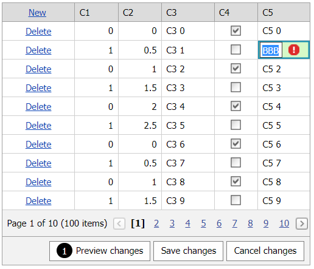

<!-- default badges list -->

[](https://supportcenter.devexpress.com/ticket/details/T170018)
[](https://docs.devexpress.com/GeneralInformation/403183)
<!-- default badges end -->
# Grid View for ASP.NET Web Forms - How to validate entered cell values on the server in batch edit mode
<!-- run online -->
**[[Run Online]](https://codecentral.devexpress.com/128532890/)**
<!-- run online end -->

This example demonstrates how to pass an editor's value to the server in batch edit mode, validate the value based on a condition, and pass the validation result to the client.



## Overview

Create the [Grid View](https://docs.devexpress.com/AspNet/DevExpress.Web.ASPxGridView) control and add a callback control to the page. For particular grid columns, specify their edit settings and handle client-side [TextChanged](https://docs.devexpress.com/AspNet/js-ASPxClientTextEdit.TextChanged) events. In the handler, get an editor's value and call the callback's [PerformCallback](https://docs.devexpress.com/AspNet/js-ASPxClientCallback.PerformCallback(parameter)) method to pass the value to the server.

```js
var editor;
function OnTextChanged(s, e) {
    editor = s;
    clb.PerformCallback(fieldName + '|' + s.GetText());
    // ...
}
```

```aspx
<dx:ASPxGridView ID="Grid" ClientInstanceName="grid" runat="server" KeyFieldName="ID" ... >
    <Columns>
        <!-- ... -->
        <dx:GridViewDataTextColumn FieldName="C3">
            <PropertiesTextEdit>
                <ClientSideEvents TextChanged="OnTextChanged" KeyDown="OnKeyDown" />
                <!-- ... -->
            </PropertiesTextEdit>
        </dx:GridViewDataTextColumn>
        <!-- ... -->
    </Columns>
    <SettingsEditing Mode="Batch" />
</dx:ASPxGridView>
<dx:ASPxCallback ID="ASPxCallback1" runat="server" ClientInstanceName="clb" OnCallback="ASPxCallback1_Callback">
    <ClientSideEvents CallbackComplete="OnCallbackComplete" />
</dx:ASPxCallback>
```

Handle the callback's server-side [Callback](https://docs.devexpress.com/AspNet/DevExpress.Web.ASPxCallback.Callback) event. In the handler, specify error text strings for invalid cells based on a condition and save these text strings to the [e.Result](https://docs.devexpress.com/AspNet/DevExpress.Web.CallbackEventArgs.Result) argument property. Then pass the result to the callback's client-side [CallbackComplete](https://docs.devexpress.com/AspNet/js-ASPxClientCallback.CallbackComplete) event to complete validation on the client. 

```js
var isError = false;
function OnCallbackComplete(s, e) {
    // ...
    if (e.result != null) {
        grid.batchEditApi.StartEdit(currentIndex, grid.GetColumnByField(fieldName).index);
        editor.SetIsValid(false);
        editor.SetErrorText(e.result);
        isError = true;
    }
    else
        isError = false;
}
```

```cs
protected void ASPxCallback1_Callback(object source, DevExpress.Web.CallbackEventArgs e) {
    string[] parameters = e.Parameter.Split('|');
    switch (parameters[0]) {
        case "C3":
            if (parameters[1] == "AAA")
                e.Result = string.Format("'{0}' is invalid value", parameters[1]);
            break;
        case "C5":
            if (parameters[1] == "BBB")
                e.Result = string.Format("'{0}' is invalid value", parameters[1]);
            break;             
        default:
            break;
    }
    // ...
}
```

## Files to Review

* [Default.aspx](./CS/Default.aspx) (VB: [Default.aspx](./VB/Default.aspx))
* [Default.aspx.cs](./CS/Default.aspx.cs) (VB: [Default.aspx.vb](./VB/Default.aspx.vb))

## Documentation

* [Grid in Batch Edit Mode](https://docs.devexpress.com/AspNet/16443/components/grid-view/concepts/edit-data/batch-edit-mode)
* [Validate Grid Data](https://docs.devexpress.com/AspNet/3747/components/grid-view/concepts/edit-data/validate-grid-data)
